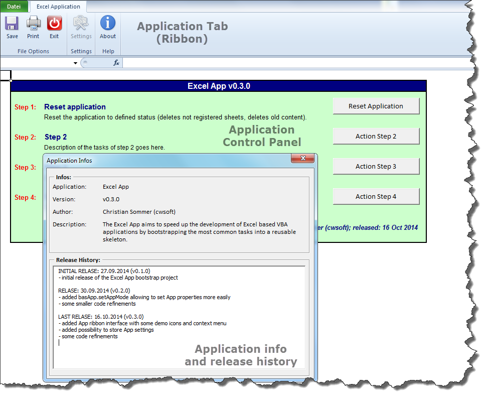

# Excel-App (Excel 2010+)

The `Excel App` aims for speeding up the development of Excel based VBA applications by bootstrapping the most common tasks into a reusable skeleton. A demo of the Excel App is provided in the  Excel 2010+ workbook `excel-app.xlsm`. The Excel App provides initialization, wrap-up, main control, error handling, release history, application infos and a own Ribbon (tab) ready to be used for your next Excel 2010+ application.

----------------------------------------
## Package overview

- [ThisWorkbook](vba/ThisWorkbook.cls): Basic event handler of the Excel App
- [basApp](vba/basApp.bas): VBA bootstrap code of the Excel App
- [basRibbon](vba/basRibbon.bas), [customUI14.xml](vba/customUI/customUI14.xml): Implements the App Ribbon interface
- [frmAppInfos](vba/frmAppInfos.frm): Form to display App infos and release history
- [Control](vba/App_Control.cls): Control sheet dealing as entry point of your Excel App
- [History](vba/App_History.cls): Hidden sheet storing the App release history
- [Settings](vba/App_Settings.cls): Hidden sheet storing the App settings

## Download
You can download the latest development branch of the `excel-app` package using GitHubs [ZIP button](https://github.com/cwsoft/excel-app/archive/main.zip).

## License
The `excel-app` package is licensed under the [GNU General Public License 3.0](./LICENSE).

## Requirements
The `excel-app` package was tested with Excel 2010+ on a Windows 10 operating system. It may work for other platforms as well, but was not tested for.
